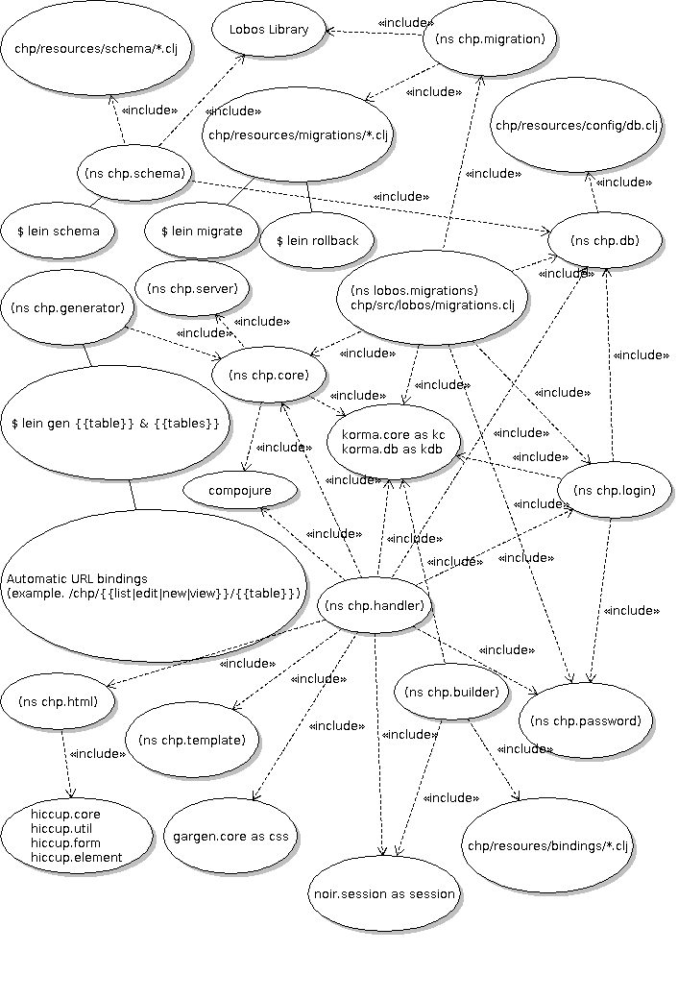

#### CHP [](https://coderwall.com/runexec)
ClojureHomePage is a Clojure Web Framework that provides the following.


* Run Clojure inside a HTML file with the ```<clj></clj>``` tags
* Request params ex. ($p userid)
* Common web headers ex. ($ user-agent)
* Web Headers ex. ($$ cache-control)
* Environmental variables ex. (env java.vm.name)
* Have multiple method handlers under a single route (get, post, put, delete, and head)
* Routes can be defined in seperate files and namespaces
* Style templates can be written in CHTML ex. chp.template/using-template
* Create SQL database schemas ex. lein schema
* Perform SQL database migrations ex. lein migrate
* Perform migration rollbacks ex. lein rollback
* Manipulate SQL databases with KormaSQL
* Generate Page views (new,view,edit,list)
* Generate JavaScript / ECMAScript
* Generate HTML
* Generate CSS

# Documentation

<b> CHTML, Routing, and Sessions </b>

* [CHTML & Routes](#example-chtml--routes)
* [Session handling, Cookies, and Compojure](#session-handling-cookies-and-compojure)

<b> Ring </b>

* [Ring and port configuration](#ring-configuration)
* [Auto-loading middleware](#auto-loading-middleware)

<b> Code Generation, Modules, and JSON API </b>

* [Generating views from a table](#generating-table-views)
* [View bindings](#builder-bindings)
* [View bindings Example](#builder-binding-views-example)
* [Enable admin account](#enable-admin-account)
* [Database and Bindings tutorial](#basic-bindings-example)
* [HTML Generation](#clojure-and-html-generation)
* [CSS Generation](#clojure-and-css-generation)
* [JavaScript Generation](#clojure-and-javascript-generation)
* [CHP Modules](#modules)
* [Module Packages](#module-packages)
* [JSON API](#json-api)
* [Auto Documenting API](#json-api-documentation-page)

<b> SQL Configuration, Migrations, and Manipulation </b>

* [SQL DB configuration and creation](#db-configuration-and-creation)
* [SQL DB Migrations](#db-migrations)
* [SQL Manipulation](#clojure-and-sql)
* [Get column syntax example](#get-column-syntax-example)

<b> General Information </b>

* [Install](#getting-started)
* [UML Relationships](#uml)
* [Namespace Dependencies](#namespace-dependencies)
* [Unit Tests](/test/chp/test/)
* [Removing example files](#removing-example-files)	
* [License](#license)
* [How?](#how)
* [Tutorial](https://github.com/runexec/chp/tree/master/tutorial/01)


# Example CHTML & Routes

Routes can be stored in two places

1. File: src/chp/handler.clj
2. Folder: src/chp/routes/

The following link is the chtml page that is used in the example below. 
<a href="https://github.com/runexec/chp/blob/master/chp-root/test-page.chtml">
   test-page.chtml
</a>

More CHTML examples are located in <a href="https://github.com/runexec/chp/blob/master/chp-root/">chp-root</a>

<b> Routes Example </b>


```clojure
(defchp app-routes

  ;; Load CHP File

  (chp-route "/chtml" 
             (binding [*title* "Test Page Example"]
               (or (root-parse "test-page.chtml")
                   "error")))
  (chp-route "/chp"
	     ;; root-parse = root-path "/" file
             (or (root-parse "chp-info.chtml")
                 "error"))
  (chp-route "/session"
            (or (root-parse "session-example.chtml")
                "error"))

  ;; Named params

  (chp-route "/index/:id"
             (format "ID is %s" 
                     (escape ($p id))))
  (chp-route "/index/:id/:action"
             (format "Action is %s" 
                     (escape ($p action))))

  ;; Multiple handlers under a single route

  (chp-route "/testing"
             (or 
              (chp-when :post "POST METHOD RETURN")
              (chp-when :get
                        (str (format "chp-body wasn't used to access %s from %s with %s"
                                     ($ uri) ($ ip) ($ user-agent))
                             (format "<p>Tracking you? DNT HTTP Header = %s</p>" ($$ dnt))
                             (format "<p>HTTP Header cache-control = %s</p>" ($$ cache-control))))
              "Not Found"))

  ;; Multiple handlers under a single route

  (chp-route "/"
             (let [display (str (format "Method %s <br />" (escape ($ method)))
                                (format "URI %s <br />" (escape ($ uri)))
                                (format "Params %s <br />" (escape ($ params)))
                                (format "Header Values <p>%s</p>"
                                        (with-out-str
                                          (doseq [[k v] (escape-map ($ headers))]
                                            (println k "=" v "<br />"))))
                                (format "Server Name %s <br /> Server IP %s"
                                        ($ server-name)
                                        ($ server-ip)))]
               (chp-body {:-get (str "Get => " display)
                          :-post (str "Post => " display)
                          :-not-found "Sorry, but this page doesn't exist"})))

  ;; Bind to templates

  (chp-route "/template"
             (using-template "example.chtml"
                             {:body "chp-info.chtml"
                              :test-tag "test-page.chtml"}))

  (route/resources "/")
  (route/not-found "Not Found"))

(def app
  (chp-site example-routes
            app-routes))
```

# Session handling, Cookies, and Compojure

Sessions are handled with the lib-noir.session namespace under the session alias.

* [lib-noir session API](https://yogthos.github.io/lib-noir/noir.session.html)

This session example can be accessed at site.com/session
```clojure
You have viewed this page 

<clj>
(let [k :view-count
      inc-view (if (nil? (session/get k))
                 (k (session/put! k 1))
                 (k (session/update-in! [k] inc)))]
  (print inc-view))
</clj>

time(s).
```

Because CHP is based on Compojure, you can use Compojure and Ring extensions. These middleware extensions should be added to the chp-routing function of the chp.core namespace. Below is what the function currently looks like.

```clojure
(defn chp-routing [& -chp-routes]
  ;;; (-> (apply routes ...) middleware-wrap xyz-wrap)
  (let [auto-middleware (fn [x] 
                             (let [wrapped (atom x)]
                               (doseq [m (load-middleware)]
                                 (swap! wrapped m))
                               @wrapped))]
    (-> (apply routes
               (reduce into [] -chp-routes))
        wrap-noir-flash
        wrap-noir-session
        auto-middleware)))
```

Already included, but not loaded by default (except noir.session), the lib-noir library is a great helper library for Clojure web development.


1. [lib-noir API](http://yogthos.github.io/lib-noir/index.html)
2. [lib-noir Github](https://github.com/noir-clojure/lib-noir)
3. [Ring CSRF protection](https://github.com/weavejester/ring-anti-forgery)
4. [Ring Middleware Extensions](https://github.com/search?q=ring+middleware&ref=cmdform&type=Repositories)

# Ring configuration

The default configuration for CHP is located in project.clj

```clojure
:ring {:port 8000
       :auto-reload? true
       :auto-refresh? true
       :reload-paths ["src/chp/"
                      "chp-root/"
                      "resources/middleware/"
                      "resources/public/"]
       :handler chp.handler/app}
```

1. [Lein-ring documentation](https://github.com/weavejester/lein-ring)


# Auto-loading Middleware

Middleware is automatically loaded from '''resources/middleware/*.clj''' when the server starts. The middleware is evaluated in the chp.core namespace with the load-middleware fn. All middleware is reloaded when triggering the ring-autoload.

```bash
$ cat resources/middleware/example.clj
```
```clojure
;; This file is automatically loaded as middleware
;; and should only contain one function.

(defn example-middleware [handler]
  (fn [request]
    (let [resp (handler request)
          headers (:headers resp)]
      (println "resources/middleware/example.clj says "
               "- Incoming request >> " headers)
      resp)))
```

# DB Configuration and Creation

A Korma SQL and Lobos compatible SQL connection configuration file is located at resources/config/db.clj

The SQL database tables are located in resources/schema/. These files can contain an unlimited amount of create calls and get evaluated by the lein alias ```lein schema```

```clojure
$ lein schema
Creating Table =>  resources/schema/example.clj
OKAY
Creating Table =>  resources/schema/user.clj
OKAY
```

The Lobos library handles the table syntax. Below is the user table from user.clj.

```clojure
(create *db*
        (table :user
               (integer :id :primary-key :auto-inc)
               (varchar :name 20)
               (varchar :password 100)
               (unique [:name])))
(create *db*
        (table :some_other_table
               (integer :id :primary-key :auto-inc)
               (varchar :name 20)
               (varchar :password 100)
               (unique [:name])))
```

1. [Lobos Project & Documentation](https://github.com/budu/lobos)
2. [More Lobos Documentation](http://budu.github.io/lobos/documentation.html)

# DB Migrations

<b> Perform migration </b>

```clojure
$ lein migrate
add-topic-table
add-topic-subject-table
add-tag-table
```

<b> Lobos migration files </b>

```bash
$ cat resources/migrations/01-add-topic-tables.clj
```
```clojure
(defmigration add-topic-table
  (up [] (create
          (tbl :topic
                 (varchar :title 50 :unique)
                 (text :content))))
  (down [] (drop (table :topic))))

(defmigration add-topic-subject-table
  (up [] (create
          (tbl :topicSubject
                 (varchar :title 50 :unique)
                 (integer :id :auto-inc :primary-key))))
  (down [] (drop (table :topicSubject))))
```
```bash 
$ cat resources/migrations/02-add-tag-table.clj
```
```clojure
(defmigration add-tag-table
  (up [] (create
          (tbl :tag
               (varchar :title 25)
               (integer :id :auto-inc :primary-key))))
  (down [] (drop (table :tag))))
```

<b> Tables after migration </b>

```bash
example=# \dt
             List of relations
 Schema |       Name       | Type  | Owner 
--------+------------------+-------+-------
 public | example          | table | on
 public | lobos_migrations | table | on
 public | tag              | table | on
 public | topic            | table | on
 public | topicSubject     | table | on
 public | user             | table | on
(6 rows)
```

<b> Rollbacks </b>

```bash
$ lein rollback
add-tag-table
$ lein rollback
add-topic-subject-table
```

<b> Tables after rollback </b>

```bash
example-# \dt
             List of relations
 Schema |       Name       | Type  | Owner 
--------+------------------+-------+-------
 public | example          | table | on
 public | lobos_migrations | table | on
 public | topic            | table | on
 public | user             | table | on
(4 rows)

example-# 
```

1. [Lobos Project & Documentation](https://github.com/budu/lobos)
2. [More Lobos Documentation](http://budu.github.io/lobos/documentation.html)

# Clojure and SQL 

ClojureHomePage uses the SQLKorma DSL by default. korma.db is required as kdb and korma.core is required as kc

1. [Korma Documentation](http://www.sqlkorma.com/)


# Get column syntax example

The $cljdb macro binds a row and allows the $db macro to retrieve columns of the row.
Example, ($cljdb table-keyword where-clause & code-body)

Here's how to use these macros

```clojure
chp.test.core> ($cljdb :user {:id 2} 
		       (format "%s id is %d"
			       ($db name)
			       ($db id)))

"admin id is 2"

chp.test.core> (kc/select {:table "user"} (kc/fields :name :id))
[{:id 2, :name "admin"}]
```

# Generating Table Views

```bash
$ lein gen user
resources/generation-templates/routes/name.clj -> src/chp/routes/user.clj
resources/generation-templates/chtml/new.chtml -> chp-root/user/new.chtml
resources/generation-templates/chtml/edit.chtml -> chp-root/user/edit.chtml
resources/generation-templates/chtml/view.chtml -> chp-root/user/view.chtml
resources/generation-templates/chtml/list.chtml -> chp-root/user/list.chtml
URL DATA BOUND TO => resources/bindings/user.clj 
site.com/new/user 
site.com/list/user 
site.com/edit/user/:id 
site.com/view/user/:id
$ cat resources/bindings/user.clj
```
```clojure
;; Example bindings for resources/schema/user.clj
;; All values will be retrieved by the id column

;; table must match the filename withut the clj extension
;; user.clj -> user

{:table :user

;; List view value
;; (chp.builder/binding-list :user 0 10)
;; /chp/list/user

 :list (list :name :id)

;; View view values
;; (chp.builder/binding->view :user 1)
;; site.com/chp/view/user/:id

 :view (list :name :password :admin)

;; Edit view values
;; (chp.builder/binding->edit :user 1)
;; site.com/chp/edit/user/:id 
;; site.com/chp/new/user

;; edit is a hash-set with table columns
;; as the key and the chp.html namespace
;; function used to display the value.

 :edit {:name #(text-field :name (escape %))
        :password #(password-field :password (escape %))
        :admin #(check-box :admin (Boolean/valueOf %))}

;; enforce data type with fn to check and
;; or convert before going into database.
;; The function must take one arg.

;; :name is limited to a string of 20 chars
;; :password is limited to 100 chars
;; :admin mut be a boolean value
 :edit-enforce {:name #(->> % str seq (take 20) (apply str))
                :password  #(->> % str seq (take 100) (apply str))
                :admin #(Boolean/valueOf %)}}
```

# Builder Bindings

The example user.clj bindings below will be used to make the new, list, view, and edit pages of the user table in schema/user.clj.

```clojure
;; Example bindings for resources/schema/user.clj
;; All values will be retrieved by the id column

;; table must match the filename withut the clj extension
;; user.clj -> user

{:table :user

;; List view value
;; (chp.builder/binding-list :user 0 10)
;; /chp/list/user

 :list (list :name :id)

;; View view values
;; (chp.builder/binding->view :user 1)
;; site.com/chp/view/user/:id

 :view (list :name :password :admin)

;; Edit view values
;; (chp.builder/binding->edit :user 1)
;; site.com/chp/edit/user/:id 
;; site.com/chp/new/user

;; edit is a hash-set with table columns
;; as the key and the chp.html namespace
;; function used to display the value.

 :edit {:name #(text-field :name (escape %))
        :password #(password-field :password (escape %))
        :admin #(check-box :admin (Boolean/valueOf %))}

;; enforce data type with fn to check and
;; or convert before going into database.
;; The function must take one arg.

 :edit-enforce {:name str
                :password str
                :admin #(Boolean/valueOf %)}}
```

# Builder binding views example

```bash
$ cd chp
$ cat resources/schema/user.clj 
```
```clojure
(create *db*
        (table :user
               (integer :id :primary-key :auto-inc)
               (varchar :name 20)
               (varchar :password 100)
               (boolean :admin)
               (unique [:name])))
```
```bash
$ lein schema
Creating Table =>  resources/schema/example.clj
OKAY
Creating Table =>  resources/schema/user.clj
OKAY
$ lein gen user
resources/generation-templates/routes/name.clj -> src/chp/routes/user.clj
resources/generation-templates/chtml/new.chtml -> chp-root/user/new.chtml
resources/generation-templates/chtml/edit.chtml -> chp-root/user/edit.chtml
resources/generation-templates/chtml/view.chtml -> chp-root/user/view.chtml
resources/generation-templates/chtml/list.chtml -> chp-root/user/list.chtml
URL DATA BOUND TO => resources/bindings/user.clj 
site.com/new/user 
site.com/list/user 
site.com/edit/user/:id 
site.com/view/user/:id
$ psql example
psql (9.2.4)
Type "help" for help.
example=# INSERT INTO "user" (name,password,admin) VALUES ('user1','badcleartext',true);
example=# \q
$ lein ring server &
Jun 24, 2013 3:40:47 PM com.mchange.v2.log.MLog <clinit>
INFO: MLog clients using java 1.4+ standard logging.
2013-06-24 15:40:47.999:INFO:oejs.Server:jetty-7.6.1.v20120215
2013-06-24 15:40:48.064:INFO:oejs.AbstractConnector:Started SelectChannelConnector@0.0.0.0:8000
Started server on port 8000

#  In another terminal  ###

$ telnet localhost 8000
Trying ::1...
Connected to localhost.
Escape character is '^]'.
GET /list/user

```
<h1>Viewing table of  user
</h1>

<div style="background:yellow;">
  <table><thead><tr><th>Action</th><th><b>id</b></th><th><b>name</b></th></tr></thead>
<tr><td><a href="/view/user/1">view</a> <a href="/edit/user/1">edit</a></td><td>1</td><td>user1</td></tr>
</table>
<br /><br /> <a href="/list/user?offset=10">More</a>

</div>
```bash
Connection closed by foreign host.


$ telnet localhost 8000
Trying ::1...
Connected to localhost.
Escape character is '^]'.
GET /view/user/1
```
<h1>Viewing  1
</h1>

[name user1]
[password badcleartext]
[admin true]

```bash
Connection closed by foreign host.


$ telnet localhost 8000
Trying ::1...
Connected to localhost.
Escape character is '^]'.
GET /edit/user/1

<h1> Editing user #1 </h1>

<form action="/edit/user/1
" method="POST">
<label for=":admin">admin</label><br /><input checked="checked" id="admin" name="admin" type="checkbox" value="true" /><br /><br /><label for=":password">password</label><br /><input id="password" name="password" type="password" value="badcleartext" /><br /><br /><label for=":name">name</label><br /><input id="name" name="name" type="text" value="user1" /><br /><br /> <input type="submit" value="save" />

</form>

Connection closed by foreign host.
```
        
# Enable Admin Account

```bash
[user@machine ~]$ cd /tmp/; mkdir admin-example; cd admin-example;
[user@machine admin-example]$ git clone https://github.com/runexec/chp.git
Cloning into 'chp'...
remote: Counting objects: 594, done.
remote: Compressing objects: 100% (331/331), done.
remote: Total 594 (delta 287), reused 501 (delta 194)
Receiving objects: 100% (594/594), 160.96 KiB | 34.00 KiB/s, done.
Resolving deltas: 100% (287/287), done.
[user@machine admin-example]$ cd chp/
[user@machine chp]$ ls
chp-examples/  chp-root/  resources/  src/  test/  tutorial/  project.clj  README.md
[user@machine chp]$ rm -rf chp-examples/ tutorial/ 
[user@machine chp]$ cat resources/schema/user.clj 
```
```clojure
(create *db*
        (table :user
               (integer :id :primary-key :auto-inc)
               (varchar :name 20)
               (varchar :password 128)
               (varchar :salt 128)
               (boolean :admin)
               (unique [:name])))
```
```bash
[user@machine chp]$ lein schema
Creating Table =>  resources/schema/user.clj
OKAY
Creating Table =>  resources/schema/example.clj
OKAY
[user@machine chp]$ lein migrate
Jun 30, 2013 2:47:07 AM com.mchange.v2.log.MLog <clinit>
INFO: MLog clients using java 1.4+ standard logging.
create-chp-admin
```

The admin password is located in the migration file resources/migrations/01-add-admin.clj
<br />
;; (chp.password/salt-set "your password here")
```bash 
[user@machine chp]$ cat resources/migrations/01-add-admin.clj
```

```clojure
(let [table (kc/create-entity "user")]

  (comment Assuming resources/schema/user.clj
           (table :user
                  (integer :id :primary-key :auto-inc)
                  (varchar :name 20)
                  (varchar :password 128)
                  (varchar :salt 128)
                  (boolean :admin)
                  (unique [:name])))

  (defmigration create-chp-admin
    (up []
        (let [{:keys [salt
                      password]} (chp.password/salt-set "admin")]
          (kc/insert table
                     (kc/values
                      {:name "admin"
                       :password password
                       :salt salt
                       :admin true}))))
    (down []
          (kc/delete table
                     (kc/where {:name "admin"})))))
```
```bash
[user@machine chp]$ lein ring server
Jun 30, 2013 2:54:20 AM com.mchange.v2.log.MLog <clinit>
INFO: MLog clients using java 1.4+ standard logging.
2013-06-30 02:54:21.391:INFO:oejs.Server:jetty-7.6.1.v20120215
2013-06-30 02:54:21.489:INFO:oejs.AbstractConnector:Started SelectChannelConnector@0.0.0.0:8000
Started server on port 8000

### In a new shell ### 

[user@machine chp]$ curl --data "username=admin&password=admin" http://localhost:8000/chp/login

<html>
<head><title>Login Handler</title></head>
<body>
Logged in{:user "admin", :logged-in? true}

</body>
</html>

[user@machine chp]$ curl --data "username=admin&password=adminadasdsad" http://localhost:8000/chp/login

<html>
<head><title>Login Handler</title></head>
<body>
Login Failed

</body>
</html>
```

# Basic bindings example

```bash
#####  get CHP

   [user@machine ~]$ mkdir blog; cd blog/
   [user@machine blog]$ git clone https://github.com/runexec/chp.git
   Cloning into 'chp'...
   remote: Counting objects: 456, done.
   remote: Compressing objects: 100% (224/224), done.
   remote: Total 456 (delta 208), reused 413 (delta 165)
   Receiving objects: 100% (456/456), 144.89 KiB | 80.00 KiB/s, done.
   Resolving deltas: 100% (208/208), done.
   [user@machine blog]$ cd chp/; ls
   chp-examples/  chp-root/  resources/  src/  test/  tutorial/  project.clj  README.md

##### Remove extra directories

   [user@machine chp]$ rm -rf chp-examples/ tutorial/

##### Create Database configuration and db

   [user@machine chp]$ cd resources/config/
   [user@machine config]$ emacs -nw -q db.clj 
   [user@machine config]$ psql example -c 'CREATE DATABASE "blog";'
   CREATE DATABASE 

##### Create tables 

[user@machine config]$ cd ../schema/
[user@machine schema]$ cat user.clj 
(create *db*
        (table :user
               (integer :id :primary-key :auto-inc)
               (varchar :name 20)
               (varchar :password 128)
               (varchar :salt 128)
               (boolean :admin)
               (unique [:name])))
[user@machine schema]$ emacs -nw news.clj 
[user@machine schema]$ cat news.clj 
(create *db*
        (table :news
               (integer :id :primary-key :auto-inc)
               (integer :userid)
               (varchar :title 100)
               (text :body)
               (unique [:title])))
[user@machine schema]$ lein schema
Creating Table =>  resources/schema/user.clj
OKAY
Creating Table =>  resources/schema/news.clj
OKAY

##### Create binding

[user@machine bindings]$ emacs -nw news.clj
[user@machine bindings]$ cat news.clj 
{:table :news
 :list (list :title :id)
 :view (list :title :body)
 :edit {:title #(text-field :title (escape %))
        :body #(text-area :body (escape %))}
 :edit-enforce {:title #(->> % str seq (take 100) (apply str))
                :body str}}

##### Create Views 


[user@machine bindings]$ lein gen news
 Jul 14, 2013 9:59:55 AM com.mchange.v2.log.MLog <clinit>
INFO: MLog clients using java 1.4+ standard logging.
 resources/generation-templates/routes/name.clj -> src/chp/routes/news.clj
resources/generation-templates/chtml/new.chtml -> chp-root/news/new.chtml
resources/generation-templates/chtml/edit.chtml -> chp-root/news/edit.chtml
resources/generation-templates/chtml/view.chtml -> chp-root/news/view.chtml
resources/generation-templates/chtml/list.chtml -> chp-root/news/list.chtml
URL DATA BOUND TO => resources/bindings/news.clj 
site.com/new/news 
site.com/list/news 
site.com/edit/news/:id 
site.com/view/news/:id

##### Add Routes to chp/src/chp/handler.clj
```
```clojure
(:require [chp.routes.news :refer [news-table-routes]])

(def app
  (chp-site news-table-routes
            example-routes
            user-table-routes
            chp-builder-paths
            app-routes))

```
```bash
[user@machine bindings]$ lein ring server
Jul 06, 2013 9:29:46 PM com.mchange.v2.log.MLog <clinit>
INFO: MLog clients using java 1.4+ standard logging.
2013-07-06 21:29:47.735:INFO:oejs.Server:jetty-7.6.1.v20120215
2013-07-06 21:29:48.834:INFO:oejs.AbstractConnector:Started SelectChannelConnector@0.0.0.0:8000
Started server on port 8000

##### Create new blog post

[user@machine bindings]$ firefox http://localhost:8000/new/news
```


# Clojure and HTML Generation

The following methods presented in the documentation below are 
accessible from within CHTML files by default. These abstractions
are drop-in replacements for the Hiccup API located at http://weavejester.github.io/hiccup/.
Please note that these forms DO NOT generate Hiccup code, but HTML.

```clojure
;;;;;;;;;;;;;;;;;;;;;;;;;;;;;;;;;;;;;; Form Fields

(escape string)

(url-encode string)

(check-box attr-map? name)
(check-box attr-map? name checked?)
(check-box attr-map? name checked? value)

(drop-down attr-map? name options)
(drop-down attr-map? name options selected)

(email-field attr-map? name)
(email-field attr-map? name value)

(file-upload attr-map? name)

(form-to attr-map? [method action] & body)

(hidden-field attr-map? name)
(hidden-field attr-map? name value)

(label attr-map? name text)

(password-field attr-map? name)
(password-field attr-map? name value)

(radio-button attr-map? group)
(radio-button attr-map? group checked?)
(radio-button attr-map? group checked? value)

(reset-button attr-map? text)

(select-options attr-map? coll)
(select-options attr-map? coll selected)

(submit-button attr-map? text)

(text-area attr-map? name)
(text-area attr-map? name value)

(text-field attr-map? name)
(text-field attr-map? name value)

;;;;;;;;;;;;;;;;;;;;;;;;;;;;;;;;;;;;;; Common Elements

(javascript-tag script)

(image attr-map? src)
(image attr-map? src alt)

(link-to attr-map? url & content)

(mail-to attr-map? e-mail & [content])

(ordered-list attr-map? coll)

(unordered-list attr-map? coll)

```

# Clojure and CSS Generation

ClojureHomePage uses the Garden CSS generation library by default.
The Garden documentation page is located at https://github.com/noprompt/garden

# Clojure and JavaScript Generation

ClojureHomePage uses ClojureScript and lein-cljsbuild to generate javascript.
CHP uses the directory resources/cljs/ as the default cljs source code directory.

1. [lein-cljsbuild Documentation](https://github.com/emezeske/lein-cljsbuild/)
2. [ClojureScript Documentation](https://github.com/clojure/clojurescript)


# Modules 

Modules are optional resources that are shipped with every release.

```bash
$ lein mod-enable middleware verbose-log example

Copying resources/modules/middleware/verbose-log.clj -> resources/middleware/verbose-log.clj
Copying resources/modules/middleware/example.clj -> resources/middleware/example.clj

$ lein mod-disable middleware verbose-log

Deleting resources/middleware/verbose-log.clj

$ lein mod-list

resources/modules
resources/modules/migrations
resources/modules/migrations/01-add-admin.clj
resources/modules/cljs
resources/modules/middleware
resources/modules/middleware/example.clj
resources/modules/middleware/operating-status.clj
resources/modules/middleware/text-mime-only.clj
resources/modules/middleware/verbose-log.clj
resources/modules/schema
resources/modules/schema/example.clj
resources/modules/schema/user.clj
resources/modules/schema/blog-post.clj
resources/modules/bindings
resources/modules/bindings/user.clj
```

# Module Packages

Module packages are stored in ```resources/packages/```. Each package is a clj file that describes what modules to install when calling ```lein package-run name1 name2 etc...```

```bash
$ cat resources/packages/admin.clj
```
```clojure
;; CHP Admin module
;; {:module-type [:module :module :module etc..]}

{:schema [:user] ;; resources/modules/schema/user.clj
 :migrations [:01-add-admin] ;; resources/modules/migrations/01-add-admin.clj
 :bindings [:user] ;; resources/modules/bindings/user.clj
 :middleware [] ;; resources/modules/middleware/ -- nothing
 :cljs [] ;; resources/modules/cljs/ -- nothing
 :api []} ;; resources/modules/api/ -- nothing
```

```bash
$ lein package-run admin

 Loading for :schema
Copying resources/modules/schema/user.clj -> resources/schema/user.clj
Creating Table =>  resources/schema/user.clj
OKAY

 Loading for :migrations
Copying resources/modules/migrations/01-add-admin.clj -> resources/migrations/01-add-admin.clj
Jul 09, 2013 7:52:37 PM com.mchange.v2.log.MLog <clinit>
INFO: MLog clients using java 1.4+ standard logging.
create-chp-admin

 Loading for :bindings
Copying resources/modules/bindings/user.clj -> resources/bindings/user.clj

 Loading for :middleware

 Loading for :cljs

 Loading for :api
```

# JSON API

To enable the JSON read-only API, create an API config file in resources/api/. Once this configuration file is made, you can access JSON values @ site.com/chp/api/{table-name}

GET params can be used to locate specific values. If the params aren't listed in the configuration, the extra params are ignored.

```bash
$ cat resources/api/user.clj
```
```clojure

;; API settings for the User table
;; the filename must be the same as the table name
;; {:table :user} => user.clj

{:table :user
 :return [:id :name]

 ;; The where key holds a map that describes 
 ;; columns that can be used to locate the 
 ;; data.

 ;; Each column key needs to have a function
 ;; as the value that accepts one arg. This
 ;; function needs to convert the arg to the
 ;; proper data type.

 ;; The single arg is a string from the uri

 :where {:id #(Integer. %)
         :name str
         :admin #(Boolean. %)}}
```
```bash
$ curl http://localhost:8000/chp/api/user; echo " << done"

{"data": [{
  "name" : "admin",
  "id" : 1
},{
  "name" : "example",
  "id" : 3
}]} << done

$ curl http://localhost:8000/chp/api/user?id=3; echo " << done"

{"data": [{
  "name" : "example",
  "id" : 3
}]} << done

$ curl http://localhost:8000/chp/api/user?name=admin; echo " << done"

{"data": [{
  "name" : "admin",
  "id" : 1
}]} << done

$ curl http://localhost:8000/chp/api/userasdasd; echo " << done"

An error occured << done
```

# JSON API Documentation Page

After creating an API config file in ```resources/api/```, you can view the dynamically generated API documentation at ```site.com/chp/api```.

Before showing the documentation page, here's what the default user API config looks like.

```bash
$ cat resources/api/user.clj
```
```clojure

;; API settings for the User table
;; the filename must be the same as the table name
;; {:table :user} => user.clj

{:table :user
 :return [:id :name]

 ;; The where key holds a map that describes 
 ;; columns that can be used to locate the 
 ;; data.

 ;; Each column key needs to have a function
 ;; as the value that accepts one arg. This
 ;; function needs to convert the arg to the
 ;; proper data type.

 ;; The single arg is a string from the uri

 :where {:id #(Integer. %)
         :name str
         :admin #(Boolean. %)}}
```

And here's what the documentation looks like for all config files in ```resources/api/```

```bash 
$ curl localhost:8000/chp/api
```

<h1>Available API</h1>

<h1 style="background:#FFFAAA"> user </h1> Data Link: <a href="/chp/api/user">user</a> <div style="background:#FFFCDD"> <table><tr><td style="padding:10px;"><h4>Data Returned</h4></td><td><h4>Optional Where Params</h4></td></tr><tr><td style="padding-left:15px;">id <br />
name <br />
</td><td>id <br />
name <br />
admin <br />
</td></tr></table> </div>


# Getting started

1) Download & Run

```bash
git clone https://github.com/runexec/chp
cd chp
lein ring server
```

2) Edit the default app-routes template located at the bottom of src/chp/handler.clj

# UML

Full image size at https://raw.github.com/runexec/chp/master/violet-uml-workings.png

(2013-07-08 JST) NOTICE: This graph is not consistent with the latest update(s) and contains minor errors.




# Namespace Dependencies 

(Generated by ntable) https://github.com/runexec/ntable

<pre>
<h3 style="background:#AFFFFF;">chp/src/chp/routes/example.clj</h3>
<b>:use</b>

chp.core
compojure.core
[chp.html :only [escape]]


<h3 style="background:#AFFFFF;">chp/src/chp/routes/user.clj</h3>
<b>:use</b>

chp.core


<h3 style="background:#AFFFFF;">chp/src/chp/routes/chp.clj</h3>
<b>:use</b>

chp.core
[cheshire.core :only [generate-string]]
[chp.api :only [api->where]]
[chp.builder :only [binding-exist?]]


<h3 style="background:#AFFFFF;">chp/src/chp/clean.clj</h3>
<h3 style="background:#AFFFFF;">chp/src/chp/migration.clj</h3>
<b>:refer-clojure</b>

:exclude
[complement alter drop bigint boolean char double float time]


<b>:use</b>

[chp.db :only [*db*]]
(lobos core connectivity migration)


<h3 style="background:#AFFFFF;">chp/src/chp/password.clj</h3>
<h3 style="background:#AFFFFF;">chp/src/chp/handler.clj</h3>
<b>:use</b>

compojure.core
chp.html
chp.template
[chp.core :exclude [korma-db]]
[chp.api :only [api->where api-dir]]
[chp.db :only [*db*]]
[garden.core :only [css]]


<b>:require</b>

chp.server
[compojure.route :as route]
[korma.db :as kdb]
[korma.core :as kc]
[noir.session :as session]
[chp.routes.chp :refer [chp-builder-paths]]
[chp.routes.example :refer [example-routes]]
[chp.routes.user :refer [user-table-routes]]


<h3 style="background:#AFFFFF;">chp/src/chp/html.clj</h3>
<b>:require</b>

hiccup.core
hiccup.util
hiccup.form
hiccup.element


<h3 style="background:#AFFFFF;">chp/src/chp/server.clj</h3>
<h3 style="background:#AFFFFF;">chp/src/chp/api.clj</h3>
<b>:use</b>

[chp.db :only [*db*]]


<b>:require</b>

[korma.db :as kdb]
[korma.core :as kc]


<h3 style="background:#AFFFFF;">chp/src/chp/package.clj</h3>
<b>:refer-clojure</b>

:exclude
[bigint boolean char double float time]


<b>:use</b>

[chp.schema :only [load-schemas]]
[chp.migration :only [chp-migrate]]
[chp.module :only [mod-enable]]


<h3 style="background:#AFFFFF;">chp/src/chp/template.clj</h3>
<b>:use</b>

chp.core


<h3 style="background:#AFFFFF;">chp/src/chp/builder.clj</h3>
<b>:use</b>

[chp.db :only [*db*]]
[chp.core :exclude [korma-db]]
chp.html
chp.password
[chp.login :exclude [korma-db]]


<b>:require</b>

[korma.core :as kc]
[korma.db :as kdb]
[noir.session :as session]


<h3 style="background:#AFFFFF;">chp/src/chp/login.clj</h3>
<b>:require</b>

[korma.db :as kdb]
[korma.core :as kc]


<b>:use</b>

[chp.db :only [*db*]]
[chp.password :only [password]]


<h3 style="background:#AFFFFF;">chp/src/chp/core.clj</h3>
<b>:use</b>

compojure.core
[noir.session :only [wrap-noir-flash wrap-noir-session]]
[chp.db :only [*db*]]


<b>:require</b>

chp.server
[compojure.handler :as handler]
[clojure.string :as string]
[korma.db :as kdb]
[korma.core :as kc]


<h3 style="background:#AFFFFF;">chp/src/chp/generator.clj</h3>
<b>:use</b>

[chp.core :only [root-path]]


<h3 style="background:#AFFFFF;">chp/src/chp/module.clj</h3>
<b>:require</b>

[clojure.java.io :as io]


<h3 style="background:#AFFFFF;">chp/src/chp/db.clj</h3>
<h3 style="background:#AFFFFF;">chp/src/chp/schema.clj</h3>
<b>:refer-clojure</b>

:exclude
[bigint boolean char double float time]


<b>:use</b>

[chp.db :only [*db*]]
[lobos.core :only [create]]


</pre>


# How?

By default, the CHTML files are located in chp-root folder of the project folder.
When a CHTML file is parsed, all public variables of the chp.handler namespace
are accessible during the evaluation of the ```<clj></clj>``` tags. Use print
 or println within the tags to have the results displayed.


# Removing Example Files

```bash
$ ls 
chp-examples/  chp-root/  resources/  src/  target/  test/  tutorial/  project.clj README.md
$ lein chp-clean
Removing README.md
Removing resources/schema
Removing resources/schema/example.clj
Removing resources/schema/user.clj
Removing resources/bindings
Removing resources/bindings/user.clj
Removing resources/migrations
Removing resources/migrations/02-add-tag-table.clj
Removing resources/migrations/01-add-topic-tables.clj
$ ls
chp-root/  resources/  src/  target/  test/  project.clj
$ ls resources/
bindings/  cljs/  config/  generation-templates/  migrations/  public/  schema/
```


# License

Copyright © 2013 Runexec

Distributed under the Eclipse Public License, the same as Clojure.
